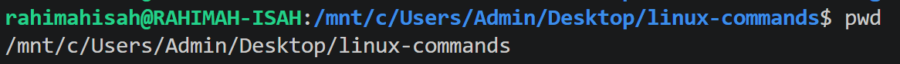
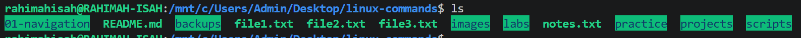
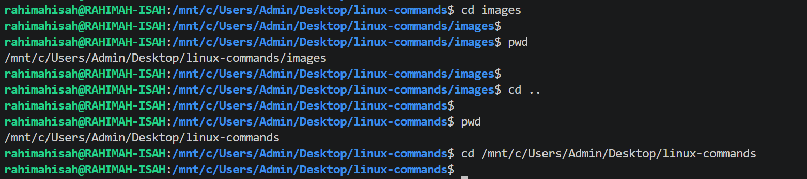

# Linux Navigation Commands

## Overview

This section covers the fundamental Linux navigation commands used to identify your current location in the filesystem, list directory contents, and move between directories. These commands form the foundation of working in a Linux environment.

## Commands Covered

- `pwd` - Print the current working directory.
- `ls` - List the contents of a directory.
- `cd` - Change the current directory.

---

# `pwd`

## Purpose

The `pwd` (Print Working Directory) command displays the absolute path of your current working directory. It helps you identify your exact location in the Linux filesystem before performing other operations.

## Syntax

```bash
pwd
```

## Example

```bash
pwd
```

## Sample Output

```text
/mnt/c/Users/Admin/Desktop/linux-commands
```
## Screenshot



## Explanation

The output shows the full (absolute) path to your current working directory. This allows you to confirm where you are before creating, deleting, copying, or moving files and directories.

## Real-World Use Cases

- Verify your current location before creating files or directories.
- Confirm that you are inside the correct Git repository.
- Avoid performing operations in the wrong directory.
- Navigate complex directory structures with confidence.

## Key Takeaways

- `pwd` stands for **Print Working Directory**.
- It displays the absolute path of your current directory.
- It does not accept any arguments.
- It is safe to run at any time.

---

# `ls`

## Purpose

The `ls` (List) command displays the contents of a directory. It allows you to view files and subdirectories in your current location or in a specified directory.

## Syntax

```bash
ls
```
## Common Options

| Option | Description |
|---------|-------------|
| `-l` | Displays files and directories in a detailed (long) format. |
| `-a` | Shows all files, including hidden files (those beginning with `.`). |
| `-h` | Displays file sizes in a human-readable format (KB, MB, GB). Used together with `-l`. |
| `-R` | Lists directories and their contents recursively. |

### Examples

```bash
ls -l
ls -a
ls -lh
ls -la
ls -lah
ls -R
```

> 💡 **Pro Tip:** `ls -lah` is one of the most commonly used command combinations because it displays hidden files, detailed information, and human-readable file sizes all at once.
## Example

```bash
ls
```

## Sample Output

```text
01-navigation  README.md  backups  file1.txt  file2.txt  file3.txt  images  labs  notes.txt  practice  projects  scripts
```

## Screenshot

> *Add a screenshot after running the `ls` command and save it as `ls-command.png` in the `images` folder.*

markdown



## Explanation

The output lists all visible files and directories in the current working directory. By default, `ls` does not display hidden files or directories (those whose names begin with a `.`).

## Real-World Use Cases

- View the contents of a directory before opening or modifying files.
- Verify that files or folders have been created successfully.
- Confirm the presence of project files before running commands.
- Quickly inspect the contents of a directory while navigating the filesystem.

## Key Takeaways

- `ls` stands for **List**.
- It displays the contents of a directory.
- By default, hidden files are not displayed.
- It is one of the most frequently used Linux commands.

---

# `cd`

## Purpose

The `cd` (Change Directory) command is used to move from one directory to another within the Linux filesystem. It is one of the most frequently used commands because almost every task in Linux starts with navigating to the correct location.

## Syntax

```bash
cd [directory]
```

## Examples

### Change to a subdirectory

```bash
cd images
```

### Move to the parent directory

```bash
cd ..
```

### Return to the home directory

```bash
cd
```

or

```bash
cd ~
```

### Navigate using an absolute path

```bash
cd /mnt/c/Users/Admin/Desktop/linux-commands
```

## Sample Output

After running:

```bash
pwd
```

```text
/mnt/c/Users/Admin/Desktop/linux-commands/images
```

## Screenshot

> *Add a screenshot after demonstrating the `cd` command and save it as `cd-command.png` in the `images` folder.*

markdown


## Explanation

The `cd` command changes your current working directory.

You can use it to:
- Move into a child directory.
- Move back to the parent directory using `..`.
- Return to your home directory using `cd` or `cd ~`.
- Navigate directly to any location using an absolute path.

## Real-World Use Cases

- Navigate to a project directory before running Git commands.
- Move into folders to create or edit files.
- Return to your home directory quickly.
- Switch between different project locations.

## Key Takeaways

- `cd` stands for **Change Directory**.
- `cd folder-name` moves into a directory.
- `cd ..` moves to the parent directory.
- `cd` and `cd ~` both return you to your home directory.
- `cd /path/to/directory` uses an absolute path to navigate directly to a location.

---

## Summary

In this section, I learned how to navigate the Linux filesystem using the `pwd`, `ls`, and `cd` commands.

- `pwd` displays the current working directory.
- `ls` lists the contents of a directory.
- `cd` changes the current working directory using relative or absolute paths.

These commands are fundamental to working efficiently in Linux because almost every task begins with locating and navigating to the correct directory.
