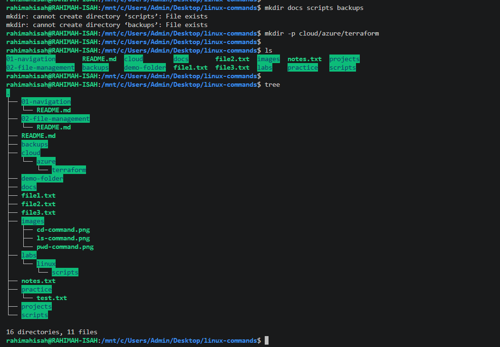
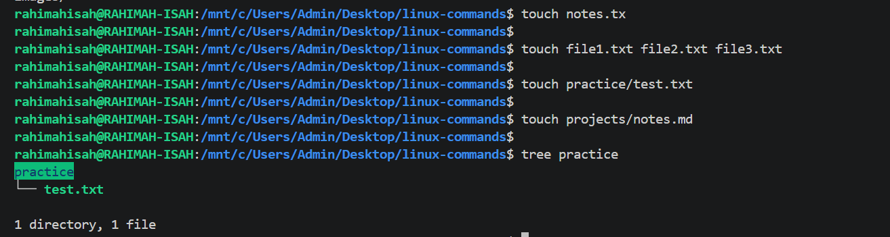
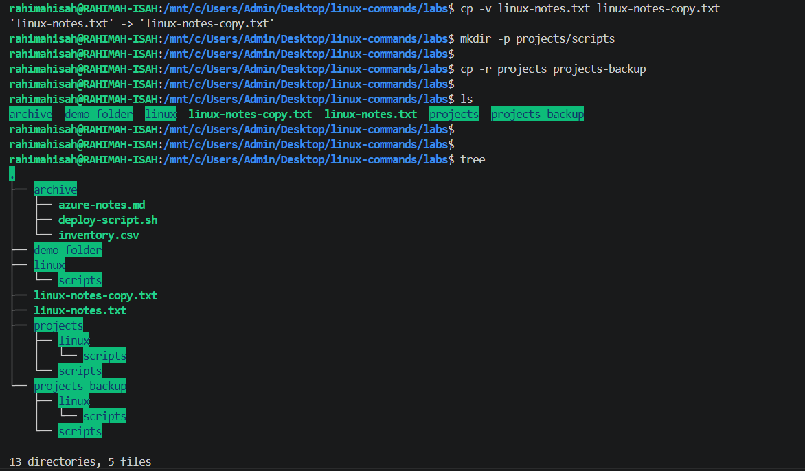
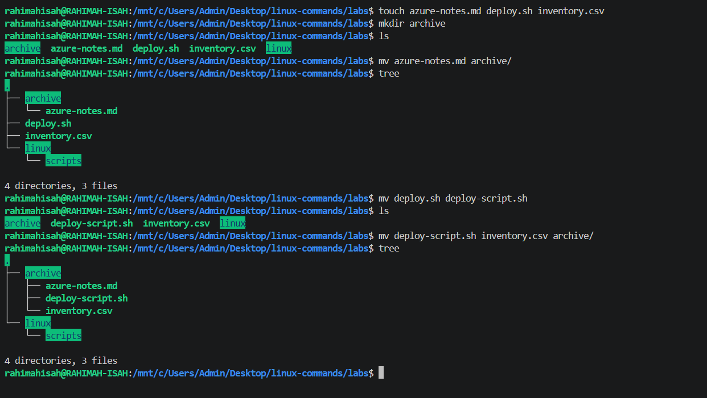

# File Management Commands

## Overview

This section documents the essential Linux commands used for creating, organizing, moving, copying, and deleting files and directories. These commands are fundamental for managing the Linux filesystem efficiently.

## Commands Covered

- `mkdir` - Create directories
- `touch` - Create empty files or update file timestamps
- `cp` - Copy files and directories
- `mv` - Move or rename files and directories
- `rm` - Remove files and directories
- `rmdir` - Remove empty directories

---
# `mkdir`

## Purpose

The `mkdir` (Make Directory) command is used to create one or more new directories. It is one of the most commonly used Linux commands for organizing files and creating project structures.

## Syntax

```bash
mkdir [directory_name]
```

## Examples

### Create a single directory

```bash
mkdir practice
```

### Create multiple directories at once

```bash
mkdir projects scripts backups
```

### Create nested directories

```bash
mkdir -p projects/azure/terraform
```

## Sample Output

```text
$ ls
01-navigation  README.md  images

$ mkdir practice

$ ls
01-navigation  README.md  images  practice
```

## Screenshot

> *Add a screenshot after demonstrating the `mkdir` command and save it as `mkdir-command.png` in the `images` folder.*




## Explanation

The `mkdir` command creates new directories in the specified location. When the `-p` option is used, it creates parent directories automatically if they do not already exist.

## Real-World Use Cases

- Create folders for new software projects.
- Organize documents, scripts, and backups.
- Build nested directory structures for applications.
- Prepare project folders before adding files.

## Key Takeaways

- `mkdir` stands for **Make Directory**.
- It can create one or multiple directories in a single command.
- The `-p` option creates parent directories automatically.
- Attempting to create an existing directory without `-p` results in an error.

---

# `touch`

## Purpose

The `touch` command is used to create one or more empty files. If the file already exists, `touch` updates its timestamp without changing its contents.

## Syntax

```bash
touch [file_name]
```

## Examples

### Create a single file

```bash
touch notes.txt
```

### Create multiple files

```bash
touch file1.txt file2.txt file3.txt
```

### Create a file inside a directory

```bash
touch practice/test.txt
```

### Create a file using a relative path

```bash
touch projects/notes.md
```

## Sample Output

```text
$ touch notes.txt

$ ls
notes.txt
```

## Screenshot

> *Add a screenshot after demonstrating the `touch` command and save it as `touch-command.png` in the `images` folder.*



## Explanation

The `touch` command creates empty files if they do not already exist. If a file already exists, it updates the file's access and modification timestamps without altering its contents.

## Real-World Use Cases

- Create configuration files before editing them.
- Prepare project files such as `README.md` or scripts.
- Generate multiple empty files quickly.
- Update timestamps for automation or testing purposes.

## Key Takeaways

- `touch` creates empty files.
- It can create multiple files in a single command.
- It can create files inside other directories using a path.
- Running `touch` on an existing file updates its timestamps.

---

# `cp`

## Purpose

The `cp` (Copy) command is used to copy files and directories from one location to another while leaving the original unchanged.

## Syntax

```bash
cp [source] [destination]
```
## Common Options

| Option | Description |
|---------|-------------|
| `-r` | Copies directories and their contents recursively. |
| `-i` | Prompts before overwriting an existing file. |
| `-v` | Displays each file as it is copied. |

### Examples

```bash
cp -v notes.txt notes-copy.txt
cp -r projects projects-backup
cp -i report.txt backup/
```

## Examples

### Copy a file

```bash
cp notes.txt notes-copy.txt
```

### Copy multiple files into a directory

```bash
cp file1.txt file2.txt backups/
```

### Copy a directory and its contents

```bash
cp -r projects projects-backup
```

## Sample Output

```text
$ cp notes.txt notes-copy.txt

$ ls
notes.txt  notes-copy.txt
```

## Screenshot

> *Add a screenshot after demonstrating the `cp` command and save it as `cp-command.png` in the `images` folder.*



## Explanation

The `cp` command copies files or directories without removing the original. When copying a directory, the `-r` (recursive) option is required to copy all files and subdirectories.

## Real-World Use Cases

- Create backup copies of important files.
- Duplicate configuration files before making changes.
- Copy project folders for testing.
- Archive work before major updates.

## Key Takeaways

- `cp` stands for **Copy**.
- The original file or directory remains unchanged.
- Use `-r` to copy directories.
- Multiple files can be copied into a destination directory in a single command.

---

# `mv`

## Purpose

The `mv` (Move) command is used to move files or directories from one location to another. It is also used to rename files and directories.

## Syntax

```bash
mv [source] [destination]
```

## Examples

### Move a file to another directory

```bash
mv notes.txt labs/
```

### Rename a file

```bash
mv notes.txt meeting-notes.txt
```

### Move multiple files into a directory

```bash
mv file1.txt file2.txt labs/
```

### Rename a directory

```bash
mv projects cloud-projects
```

## Sample Output

```text
$ mv notes.txt labs/

$ ls labs
notes.txt
```

## Screenshot

> *Add a screenshot after demonstrating the `mv` command and save it as `mv-command.png` in the `images` folder.*



## Explanation

The `mv` command moves files or directories to a new location. If the destination is a filename instead of a directory, `mv` renames the file or directory instead of moving it.

## Real-World Use Cases

- Organize files into project folders.
- Rename files to more meaningful names.
- Move completed work into archive folders.
- Reorganize project directories.

## Key Takeaways

- `mv` stands for **Move**.
- It moves files and directories.
- It is also used to rename files and directories.
- Unlike `cp`, it does **not** leave the original behind.

## 💡 Common Mistakes

- Moving a file into the wrong directory by specifying the wrong destination.
- Accidentally overwriting an existing file with the same name.
- Forgetting that `mv` removes the file from its original location.
