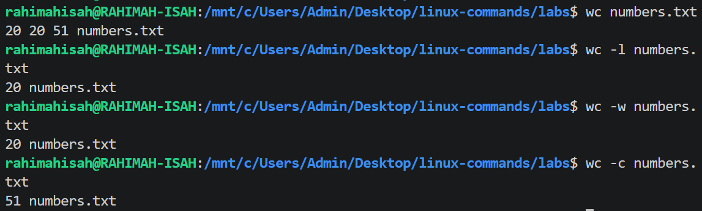
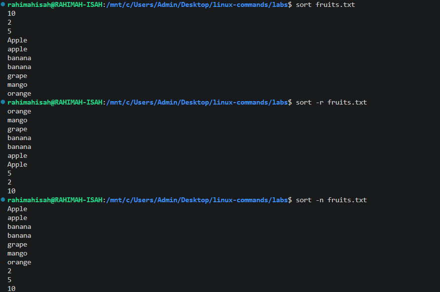
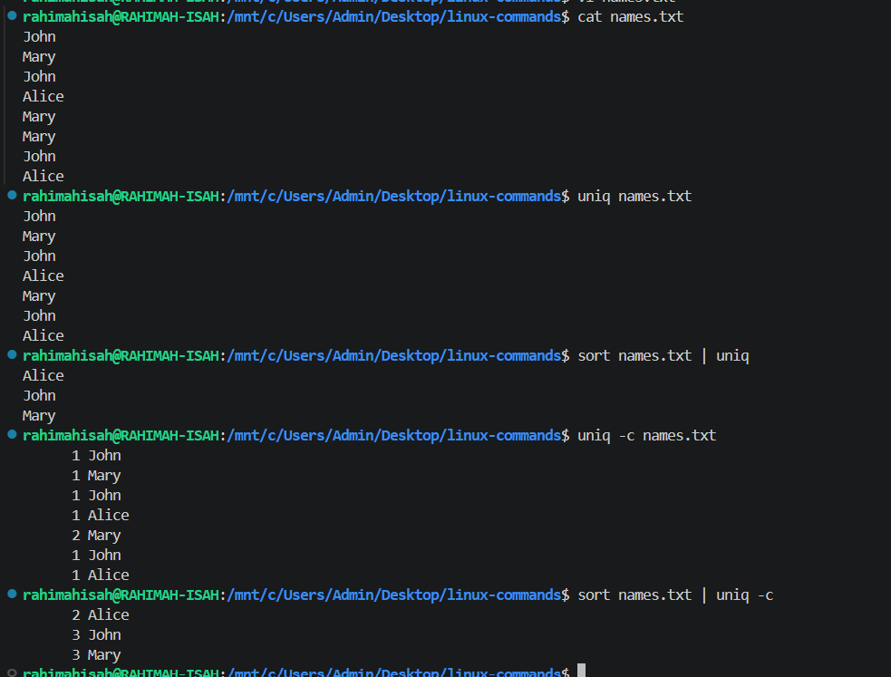
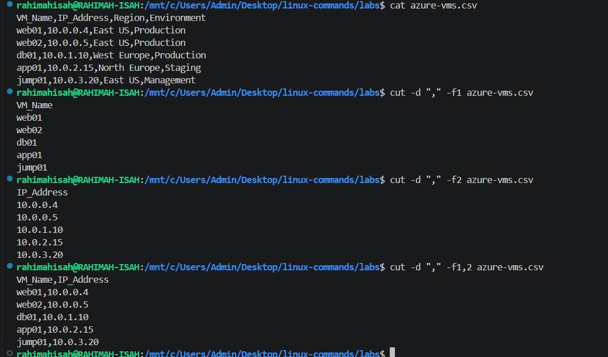

# Sorting & Text Processing Commands

This section covers Linux commands used to organize, count, transform, and process text files. These commands are especially useful when working with logs, datasets, configuration files, and command output.

## Commands Covered

- `wc` - Count lines, words, and bytes.
- `sort` - Sort lines of text alphabetically or numerically.
- `uniq` - Remove or identify duplicate lines.
- `cut` - Extract specific columns or fields from text.
- `tr` - Translate or replace characters.
- `tee` - Display output and write it to a file simultaneously.

---
# wc Command

## Purpose

The `wc` (word count) command counts the number of lines, words, bytes, or characters in a file. It is commonly used to quickly determine the size and content statistics of text files.

## Syntax

```bash
wc [OPTION]... [FILE]...
```

## Common Options

| Option | Description |
|---------|-------------|
| `-l` | Counts the number of lines. |
| `-w` | Counts the number of words. |
| `-c` | Counts the number of bytes. |

## Examples

```bash
wc numbers.txt
```

Displays the number of lines, words, and bytes in the file.

```bash
wc -l numbers.txt
```

Displays only the number of lines.

```bash
wc -w numbers.txt
```

Displays only the number of words.

```bash
wc -c numbers.txt
```

Displays only the number of bytes.

## Sample Output

See the screenshot below.



## Real-World Use Cases

- Count the number of records in a text file.
- Determine the number of lines in a log file.
- Check the size of text files.
- Verify the number of words in documentation or reports.

## Key Takeaways

- `wc` stands for **word count**.
- By default, it displays the number of **lines**, **words**, and **bytes**.
- Use options such as `-l`, `-w`, and `-c` to display specific counts.

## Common Mistakes

- Assuming `wc` only counts words.
- Confusing bytes (`-c`) with characters, especially when working with files containing special or Unicode characters.

## Pro Tip

Combine `wc` with other commands using pipes. For example:

```bash
ls | wc -l
```

This counts the number of items in the current directory.

# sort Command

## Purpose

The `sort` command arranges the lines of a text file in a specific order. By default, it sorts alphabetically, but it can also sort numerically, in reverse order, or remove duplicate lines.

## Syntax

```bash
sort [OPTION]... [FILE]
```

## Common Options

| Option | Description |
|---------|-------------|
| `-r` | Sorts in reverse (descending) order. |
| `-n` | Sorts numerically instead of alphabetically. |
| `-u` | Sorts the lines and removes duplicate entries. |

## Examples

### Sort alphabetically

```bash
sort fruits.txt
```

Sorts the contents of the file in ascending alphabetical order.

### Sort in reverse order

```bash
sort -r fruits.txt
```

Displays the lines in reverse alphabetical order.

### Sort numerically

```bash
sort -n fruits.txt
```

Treats numeric values as numbers instead of text, producing the correct numeric order.

### Sort and remove duplicates

```bash
sort -u fruits.txt
```

Sorts the file and removes duplicate lines.

## Sample Output

See the screenshot below.



## Real-World Use Cases

- Sort names, usernames, or email addresses alphabetically.
- Arrange numerical data such as scores or IDs.
- Remove duplicate entries from datasets.
- Prepare data before using commands like `uniq`.

## Key Takeaways

- By default, `sort` performs an alphabetical sort.
- Use `-n` when sorting numbers.
- Use `-r` to reverse the sorting order.
- Use `-u` to sort while removing duplicate lines.

## Common Mistakes

- Forgetting that `sort` treats numbers as text unless `-n` is used.
- Assuming `sort -u` only removes duplicates. It also sorts the data.

## Pro Tip

You can combine `sort` with other commands. For example:

```bash
sort fruits.txt | wc -l
```

Counts the number of sorted lines.

Or:

```bash
sort fruits.txt | uniq
```

Although this works, using:

```bash
sort -u fruits.txt
```

is shorter and more efficient because it sorts and removes duplicates in a single command.

# uniq Command

## Purpose

The `uniq` command filters out or reports repeated lines in a text file. It only detects **consecutive (adjacent)** duplicate lines, which is why it is commonly used together with the `sort` command.

## Syntax

```bash
uniq [OPTION]... [FILE]
```

## Common Options

| Option | Description |
|---------|-------------|
| `-c` | Displays the number of occurrences of each consecutive line. |
| `-d` | Displays only duplicate lines. |
| `-u` | Displays only unique (non-duplicate) lines. |

## Examples

### Remove consecutive duplicate lines

```bash
uniq names.txt
```

Removes only adjacent duplicate lines.

### Sort the file and remove all duplicates

```bash
sort names.txt | uniq
```

Sorts the file first, then removes all duplicate entries.

### Count duplicate occurrences

```bash
sort names.txt | uniq -c
```

Displays the number of times each unique entry appears.

## Sample Output

See the screenshot below.



## Real-World Use Cases

- Remove duplicate usernames from system reports.
- Count repeated IP addresses in web server logs.
- Identify duplicate entries in configuration files.
- Generate a list of unique server names or hostnames.

## Key Takeaways

- `uniq` only removes **adjacent** duplicate lines.
- For complete duplicate removal, use `sort` before `uniq`.
- The `-c` option counts how many times each entry appears.

## Common Mistakes

- Assuming `uniq` removes every duplicate in a file.
- Forgetting to sort the file before using `uniq`.
- Expecting `uniq` to detect duplicates that are separated by other lines.

## Pro Tip

To count how many times each IP address appears in a server log:

```bash
sort access.log | uniq -c
```

This is a common technique used by Linux and DevOps engineers to analyze log files and identify repeated events.

# cut Command

## Purpose

The `cut` command extracts specific columns or fields from a file or command output. It is commonly used to retrieve selected information from structured text files such as CSV files, log files, and reports.

## Syntax

```bash
cut [OPTION]... [FILE]
```

## Common Options

| Option | Description |
|---------|-------------|
| `-d` | Specifies the field delimiter. |
| `-f` | Specifies the field(s) to extract. |

## Examples

### Extract the first column (VM Names)

```bash
cut -d "," -f1 azure-vms.csv
```

Displays only the virtual machine names.

### Extract the IP addresses

```bash
cut -d "," -f2 azure-vms.csv
```

Displays only the IP addresses.

### Extract the Azure regions

```bash
cut -d "," -f3 azure-vms.csv
```

Displays only the deployment regions.

### Extract multiple columns

```bash
cut -d "," -f1,2 azure-vms.csv
```

Displays both the VM names and their IP addresses.

### Extract the environment

```bash
cut -d "," -f4 azure-vms.csv
```

Displays the environment (Production, Staging, Management).

## Sample Output

See the screenshot below.



## Real-World Use Cases

- Extract VM names from Azure inventory exports.
- Retrieve only IP addresses from infrastructure reports.
- Filter selected columns from CSV files.
- Prepare data for automation scripts.
- Process cloud resource inventories without opening spreadsheet software.

## Key Takeaways

- `cut` extracts specific fields from structured text.
- Use `-d` to define the delimiter.
- Use `-f` to specify one or more fields.
- Multiple fields can be extracted by separating them with commas.

## Common Mistakes

- Forgetting to specify the correct delimiter.
- Using spaces instead of commas when working with CSV files.
- Using `cut` on data that isn't consistently structured.

## Pro Tip

You can combine `cut` with other commands. For example:

```bash
cut -d "," -f4 azure-vms.csv | sort | uniq -c
```

This counts how many virtual machines are deployed in each environment.