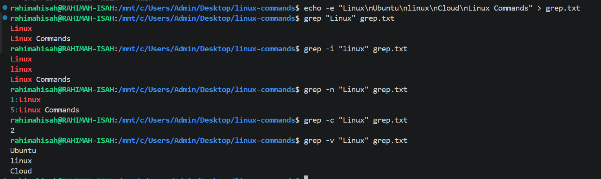

# 04. Searching & Filtering

This section covers Linux commands used to locate files, search for text, and identify executable programs.

## Commands Covered

- `find` — Search for files and directories.
- `locate`(locate.md) — Find files quickly using a database.
- `grep` — Search for text patterns in files.
- `which`— Locate the executable of a command.
- `whereis` — Find a command's binary, source, and manual pages.

---

# find Command

## Purpose

The **`find`** command searches for files and directories within a specified location based on criteria such as name, type, size, or modification time.

---

## Syntax

```bash
find [PATH] [EXPRESSION]
```

---

## Common Options

| Option | Description |
|---------|-------------|
| `-name` | Search by file or directory name (case-sensitive) |
| `-iname` | Search by file or directory name (case-insensitive) |
| `-type f` | Search for files only |
| `-type d` | Search for directories only |

---

## Examples

### Search for all text files

```bash
find . -name "*.txt"
```

Searches the current directory and all subdirectories for files ending with `.txt`.

---

### Search for files only

```bash
find . -type f
```

Lists all files in the current directory and its subdirectories.

---

### Search for directories only

```bash
find . -type d
```

Lists all directories in the current directory and its subdirectories.

---

### Case-insensitive search

```bash
find . -iname "*.PNG"
```

Searches for PNG files regardless of whether the filename uses uppercase or lowercase letters.

---

## Sample Output

See the screenshot below.


---

## Real-World Use Cases

- Locate files in large directory structures.
- Search for configuration files.
- Find specific file types such as `.txt`, `.log`, or `.png`.
- Locate directories before performing maintenance or cleanup.

---

## Key Takeaways

- `find` searches recursively through directories.
- It can search by file name, directory name, type, size, permissions, and much more.
- `-iname` performs a case-insensitive search.
- `-type` allows you to distinguish between files and directories.

---

## Common Mistakes

- Forgetting to specify the starting directory (`.`).
- Forgetting to enclose wildcard patterns like `"*.txt"` in quotes.
- Using `-name` when a case-insensitive search (`-iname`) is required.

---

## 💡 Pro Tip

Combine `find` with other commands for powerful automation.

Example:

```bash
find . -name "*.log" -exec rm {} \;
```

This command finds every `.log` file and removes it automatically.

> **Be careful** when using `-exec rm`, as deleted files cannot be easily recovered.

# grep Command

## Purpose

The **`grep`** command searches for lines in a file or input that match a specified pattern. It is one of the most frequently used commands for searching logs, configuration files, and command output.

---

## Syntax

```bash
grep [OPTION]... PATTERN [FILE]...
```

---

## Common Options

| Option | Description |
|---------|-------------|
| `-i` | Ignore case distinctions |
| `-n` | Display line numbers |
| `-r` | Search recursively through directories |
| `-v` | Show lines that do **not** match the pattern |
| `-c` | Display only the number of matching lines |

---

## Examples

### Search for a word

```bash
grep "Linux" output.txt
```

Displays all lines containing **Linux**.

---

### Ignore letter case

```bash
grep -i "linux" output.txt
```

Matches **Linux**, **LINUX**, **linux**, and similar variations.

---

### Display line numbers

```bash
grep -n "Linux" output.txt
```

Shows matching lines together with their line numbers.

---

### Count matching lines

```bash
grep -c "Linux" output.txt
```

Displays the total number of matching lines.

---

### Display non-matching lines

```bash
grep -v "Linux" output.txt
```

Shows every line **except** those containing **Linux**.

---

## Sample Output

See the screenshot below.



---

## Real-World Use Cases

- Search log files for errors.
- Find configuration settings.
- Filter command output.
- Search source code for keywords.
- Analyze application logs.

---

## Key Takeaways

- `grep` searches for text patterns.
- It works with files and piped command output.
- It supports case-insensitive, recursive, and inverted searches.
- It is one of the most widely used Linux commands.

---

## Common Mistakes

- Forgetting quotation marks around patterns containing spaces.
- Using `grep` without considering case sensitivity.
- Searching the wrong file or directory.

---

## 💡 Pro Tip

`grep` becomes even more powerful when combined with pipes.

Example:

```bash
ps aux | grep nginx
```

This searches the running processes for **nginx**.
```

