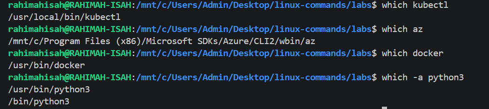
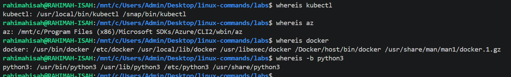

# 04. Searching & Filtering

This section covers Linux commands used to locate files, search for text, and identify executable programs.

## Commands Covered

- [`find`](find.md) — Search for files and directories.
- [`locate`](locate.md) — Find files quickly using a database.
- [`grep`](grep.md) — Search for text patterns in files.
- [`which`](which.md) — Locate the executable of a command.
- [`whereis`](whereis.md) — Find a command's binary, source, and manual pages.

---

# find Command

## Purpose

The **`find`** command searches for files and directories within a specified location based on criteria such as name, type, size, or modification time.

---

## Syntax

```bash
find [PATH] [EXPRESSION]
```

---

## Common Options

| Option | Description |
|---------|-------------|
| `-name` | Search by file or directory name (case-sensitive) |
| `-iname` | Search by file or directory name (case-insensitive) |
| `-type f` | Search for files only |
| `-type d` | Search for directories only |

---

## Examples

### Search for all text files

```bash
find . -name "*.txt"
```

Searches the current directory and all subdirectories for files ending with `.txt`.

---

### Search for files only

```bash
find . -type f
```

Lists all files in the current directory and its subdirectories.

---

### Search for directories only

```bash
find . -type d
```

Lists all directories in the current directory and its subdirectories.

---

### Case-insensitive search

```bash
find . -iname "*.PNG"
```

Searches for PNG files regardless of whether the filename uses uppercase or lowercase letters.

---

## Sample Output

See the screenshot below.


---

## Real-World Use Cases

- Locate files in large directory structures.
- Search for configuration files.
- Find specific file types such as `.txt`, `.log`, or `.png`.
- Locate directories before performing maintenance or cleanup.

---

## Key Takeaways

- `find` searches recursively through directories.
- It can search by file name, directory name, type, size, permissions, and much more.
- `-iname` performs a case-insensitive search.
- `-type` allows you to distinguish between files and directories.

---

## Common Mistakes

- Forgetting to specify the starting directory (`.`).
- Forgetting to enclose wildcard patterns like `"*.txt"` in quotes.
- Using `-name` when a case-insensitive search (`-iname`) is required.

---

## 💡 Pro Tip

Combine `find` with other commands for powerful automation.

Example:

```bash
find . -name "*.log" -exec rm {} \;
```

This command finds every `.log` file and removes it automatically.

> **Be careful** when using `-exec rm`, as deleted files cannot be easily recovered.

# which Command

## Purpose

The **`which`** command locates the executable file of a command by searching the directories listed in the system's `PATH` environment variable.

---

## Syntax

```bash
which COMMAND
```

---

## Common Options

| Option | Description |
|---------|-------------|
| `-a` | Display all matching executable paths |

---

## Examples

### Locate the Kubernetes CLI

```bash
which kubectl
```

Displays the location of the Kubernetes CLI.

---

### Locate the Azure CLI

```bash
which az
```

Displays the location of the Azure CLI.

---

### Locate Docker

```bash
which docker
```

Displays the location of the Docker executable.

---

### Show all matching executables

```bash
which -a python3
```

Displays every `python3` executable found in your `PATH`.

---

## Sample Output

See the screenshot below.



---

## Real-World Use Cases

- Verify that tools such as **kubectl**, **docker**, or **az** are installed.
- Identify which executable is being used when multiple versions exist.
- Troubleshoot PATH-related issues.

---

## Key Takeaways

- `which` searches only executable files.
- It searches directories listed in the `PATH` environment variable.
- `-a` displays all matching executables.

---

## Common Mistakes

- Using `which` to search for regular files.
- Assuming a command is installed when it is not in the `PATH`.
- Forgetting to use `-a` when multiple versions exist.

---

## 💡 Pro Tip

Before troubleshooting a tool, verify its installation first.

Example:

```bash
which kubectl
```

If no path is returned, the command is either not installed or not available in your `PATH`.

# whereis Command

## Purpose

The **`whereis`** command locates the binary, source code, and manual pages associated with a command.

---

## Syntax

```bash
whereis COMMAND
```

---

## Common Options

| Option | Description |
|---------|-------------|
| `-b` | Search for binary files only |
| `-m` | Search for manual pages only |
| `-s` | Search for source files only |

---

## Examples

### Locate the Kubernetes CLI

```bash
whereis kubectl
```

Displays the binary and related files for `kubectl`.

---

### Locate the Azure CLI

```bash
whereis az
```

Displays the binary location for Azure CLI.

---

### Locate Docker

```bash
whereis docker
```

Displays Docker's binary and related files.

---

### Search for binaries only

```bash
whereis -b python3
```

Displays only the executable location for Python.

---

## Sample Output

See the screenshot below.



---

## Real-World Use Cases

- Verify where a command is installed.
- Locate documentation (man pages).
- Troubleshoot software installations.
- Confirm binary locations for DevOps tools.

---

## Key Takeaways

- `whereis` searches for binaries, source files, and manual pages.
- It is different from `which`, which searches only executables in the `PATH`.
- Use `-b`, `-m`, or `-s` to narrow the search.

---

## Common Mistakes

- Confusing `whereis` with `which`.
- Expecting `whereis` to search arbitrary files.
- Assuming every command has source files installed.

---

## 💡 Pro Tip

Use both commands together when troubleshooting.

```bash
which kubectl
whereis kubectl
```

`which` tells you which executable will run, while `whereis` shows additional related files such as binaries and manual pages.
