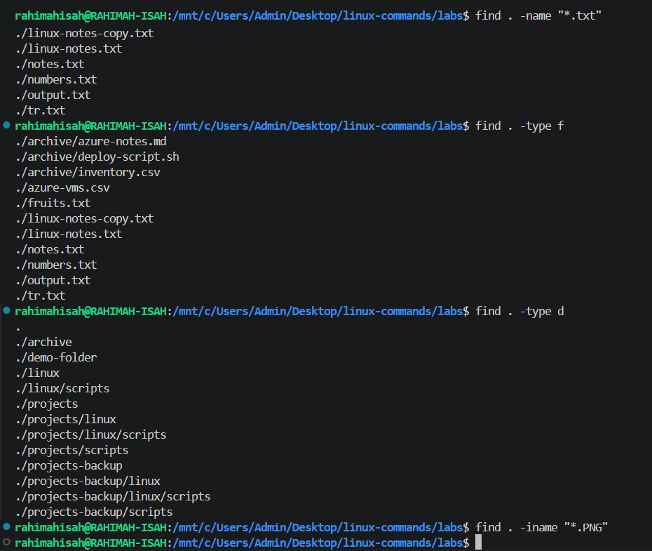
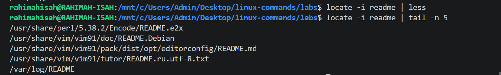

# 04. Searching & Filtering

This section covers Linux commands used to locate files, search for text, and identify executable programs.

## Commands Covered

- `find` — Search for files and directories.
- `locate`(locate.md) — Find files quickly using a database.
- `grep` — Search for text patterns in files.
- `which`— Locate the executable of a command.
- `whereis` — Find a command's binary, source, and manual pages.

---

# find Command

## Purpose

The **`find`** command searches for files and directories within a specified location based on criteria such as name, type, size, or modification time.

---

## Syntax

```bash
find [PATH] [EXPRESSION]
```

---

## Common Options

| Option | Description |
|---------|-------------|
| `-name` | Search by file or directory name (case-sensitive) |
| `-iname` | Search by file or directory name (case-insensitive) |
| `-type f` | Search for files only |
| `-type d` | Search for directories only |

---

## Examples

### Search for all text files

```bash
find . -name "*.txt"
```

Searches the current directory and all subdirectories for files ending with `.txt`.

---

### Search for files only

```bash
find . -type f
```

Lists all files in the current directory and its subdirectories.

---

### Search for directories only

```bash
find . -type d
```

Lists all directories in the current directory and its subdirectories.

---

### Case-insensitive search

```bash
find . -iname "*.PNG"
```

Searches for PNG files regardless of whether the filename uses uppercase or lowercase letters.

---

## Sample Output

See the screenshot below.



---

## Real-World Use Cases

- Locate files in large directory structures.
- Search for configuration files.
- Find specific file types such as `.txt`, `.log`, or `.png`.
- Locate directories before performing maintenance or cleanup.

---

## Key Takeaways

- `find` searches recursively through directories.
- It can search by file name, directory name, type, size, permissions, and much more.
- `-iname` performs a case-insensitive search.
- `-type` allows you to distinguish between files and directories.

---

## Common Mistakes

- Forgetting to specify the starting directory (`.`).
- Forgetting to enclose wildcard patterns like `"*.txt"` in quotes.
- Using `-name` when a case-insensitive search (`-iname`) is required.

---

## 💡 Pro Tip

Combine `find` with other commands for powerful automation.

Example:

```bash
find . -name "*.log" -exec rm {} \;
```

This command finds every `.log` file and removes it automatically.

> **Be careful** when using `-exec rm`, as deleted files cannot be easily recovered.

# locate Command

## Purpose

The **`locate`** command quickly searches for files and directories using a prebuilt database instead of scanning the filesystem in real time, making it much faster than the `find` command.

---

## Syntax

```bash
locate [OPTION]... PATTERN
```

---

## Common Options

| Option | Description |
|---------|-------------|
| `-i` | Ignore case distinctions |
| `-c` | Display only the number of matching entries |
| `-r` | Search using a regular expression |

---

## Examples

### Search for a file

```bash
locate README.md
```

Searches for all files named **README.md**.

---

### Case-insensitive search

```bash
locate -i readme
```

Searches regardless of uppercase or lowercase letters.

---

### Count matching files

```bash
locate -c README.md
```

Displays only the total number of matching files.

---

### Search using a regular expression

```bash
locate -r ".*\.png$"
```

Searches for files ending with `.png`.

---

## Sample Output

See the screenshot below.



---

## Real-World Use Cases

- Locate files instantly without searching the entire filesystem.
- Find configuration files.
- Search for documents, images, or scripts.
- Quickly verify whether a file exists.

---

## Key Takeaways

- `locate` is much faster than `find` because it uses a database.
- Results depend on the database being up to date.
- Use `updatedb` to refresh the database when necessary.

---

## Common Mistakes

- Expecting newly created files to appear immediately.
- Forgetting to update the database with `updatedb`.
- Assuming `locate` searches the filesystem in real time.

---

## 💡 Pro Tip

If a file isn't found but you're sure it exists, update the database first:

```bash
sudo updatedb
```

Then run your `locate` command again.

